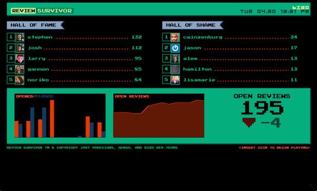

# Crucible Survivor

[](https://drone.io/github.com/ogrodnek/crucible-survivor/latest)

  Crucible Survivor is a Hall of Fame / Hall of Shame dashboard for code reviews that integrates with [Crucible](https://www.atlassian.com/software/crucible/overview).




## Design / Credits

  The design is taken from [Jira Survivor](http://blog.gengo.com/jira-survivor/), which itself was forked from [Github Survivor](http://99designs.com/tech-blog/blog/2013/01/05/github-survivor/).

## Code and Application Architecture

  The code is a large departure from the original projects.  The original projects use a Mongo DB to store data scraped from the github/jira APIs, and a python web app to serve the site.

  Crucible Survivor is an angular app that is mostly static.  The review stats are included in the app as a JS include.  The app is hosted as a static website in S3, with the contents of the stats JS generated periodically by a jenkins server.

  This was a hack-day experiment in 'static' dashboard apps, and I'm really happy with how it came out.  I really like how gathering the content to display is decoupled from the display.  Serving the site requires no server infrastructure, and the update process can be very flexible.  Finally, it's incredible easy to test/run locally -- just generate a fake stats file and open the site.

## Running

  The dashboard is meant to be run as a static site in Amazon S3, but it can be hosted by any web server that can host static content.

   A fake stats file is included for testing, so the site will display out of the box.  For local testing, I typically run it using python's SimpleHTTPServer, e.g.
  
```
cd src/main/webapp/
python -m SimpleHTTPServer
```

  Any method of serving a static site from disk will work.

## Generating review stats file

### Configuration

  The configuration is taken from the environment, the following environment variables must be set:
  
  * Crucible configuration
    * CRUCIBLE_HOST (hostname of your crucible server)
    * CRUCIBLE_USER
    * CRUCIBLE_PASS

### Running Stats Generation
  `./gen-stats.sh <outfile>`
  
  For example, to overwrite the provided example stats file, you can run `./gen-stats.sh src/main/webapp/app/gen/leader.js`
  
### Running in Jenkins and deploying to S3

For my jenkins setup, I set the above environment variables, then have an *Execute shell* step as follows:

```
F=`mktemp`
$WORKSPACE/gen-stats.sh $F
s3cp $F s3://<my bucket>/app/gen/leader.js --acl 'public-read' --headers 'Content-Type: application/javascript'
rm $F
```
(Using [s3cp](https://github.com/aboisvert/s3cp) for coping the generated stats file to S3).

## Developing/Eclipse

This project uses sbt.  Currently it's included to make it easier to generate stats.

Run `sbt eclipse` (or `./sbt eclipse`) to generate eclipse project and .classpath files.
